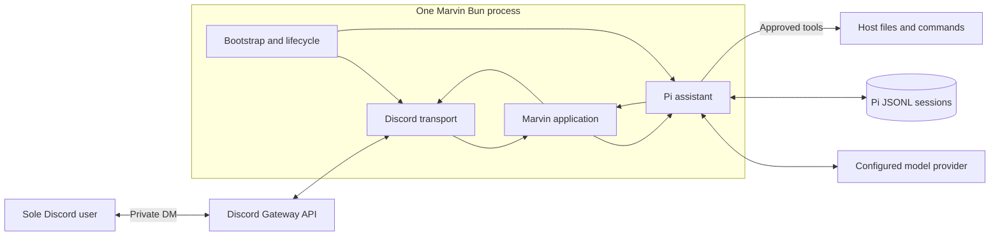
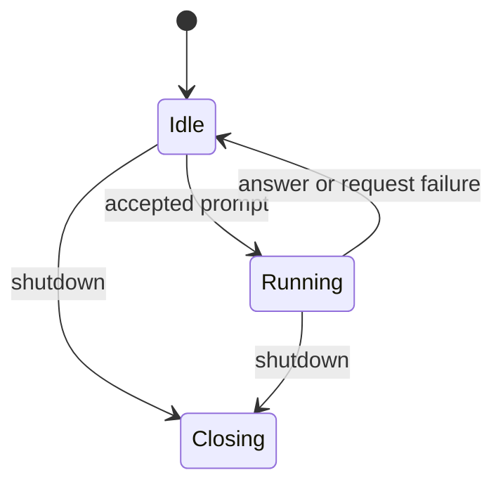

# Marvin System Architecture

**Status:** Proposed for the first release  
**Scope:** Runtime boundaries, state ownership, persistence, and externally visible behavior. TypeScript modules and SDK calls belong in [`program-design.md`](./program-design.md).

## Goals

Marvin is a personal AI assistant reached through Discord direct messages. The first release must:

- serve the sole user who can see and message the private Discord application;
- preserve completed conversational context across process restarts;
- run agentic tasks with approved tools, including shell access;
- process only one request at a time and reject overlapping requests;
- expose accepted, busy, and failed outcomes promptly;
- deliver long responses without losing source text at Discord's message limit; and
- remain simple to run as a single-host personal service.

## Architecture decisions

1. **One Bun process.** Marvin has no HTTP API, worker service, broker, or application database.
2. **Discord visibility is the user boundary.** The application is private and visible only to the sole user. Marvin validates event shape but keeps no second user-ID allowlist.
3. **Pi owns the agent and conversation history.** Marvin embeds `@earendil-works/pi-coding-agent`; Pi's native JSONL sessions are the only conversation store.
4. **One continuing conversation.** Marvin resumes the most recent usable Pi session and exposes no conversation-switching control.
5. **No prompt queue.** Marvin starts a prompt only while Pi is idle. A prompt received while Pi is running is rejected as busy without being forwarded or retained.
6. **In-flight work is volatile.** A process exit may lose it.
7. **Discord delivery is best effort.** Marvin preserves text and order during normal delivery but has no durable outbox or exactly-once guarantee.
8. **Shell isolation is an operating-system boundary.** A working directory is not a sandbox. Marvin must run as a dedicated non-root identity or in a suitably restricted container.

## System context



Discord and the configured model provider are the only required network integrations. Shell commands inherit any network access granted by the deployment environment. Marvin opens no inbound network port.

## Responsibilities

| Component | Responsibility |
| --- | --- |
| Bootstrap and lifecycle | Validate configuration, create Pi before Discord login, install signal handling, and perform bounded shutdown. |
| Discord transport | Accept valid one-to-one text DMs, ignore unsupported events, serialize outgoing responses, split long text, and disable mention expansion. |
| Marvin application | Route prompts, format acknowledgements and safe failures, and connect Pi outcomes to the sole output destination. |
| Pi assistant | Own the active runtime and session, atomically admit one prompt at a time, reduce raw Pi events, handle terminal failures, and close cleanly. |

These are responsibility boundaries, not separate services. Logging and message splitting are small implementation utilities rather than architectural components.

## Discord ingress

Marvin consumes Discord `MessageCreate` events. An event is accepted only when:

```text
author.bot       = false
channel.type     = one-to-one DM
content.trim()   is non-empty
```

Application visibility is trusted to ensure that an accepted DM belongs to the sole user. Guild messages, group DMs, bot messages, and empty messages are ignored. An attachment-only message receives a short text-only response. When a message contains both text and attachments, only its text is processed.

Discord message IDs may be retained briefly for transport deduplication or logging, but they are not conversation state. Because every accepted message has the same output destination, Pi outcomes do not carry per-prompt Discord correlation objects.

## Prompt admission

Inspection of Pi's current state and the corresponding operation form one atomic admission decision:

```text
idle                -> start Pi prompt; acknowledge Working.
running             -> reject without retaining text; report busy.
shutting down       -> reject; report temporarily unavailable.
```

State inspection and prompt start are serialized so concurrent Discord events cannot both observe Pi as idle. Marvin never calls Pi's follow-up APIs. Text rejected while Pi is running remains available only in Discord history and must be sent again after the active request finishes.

## Runtime state

Externally meaningful state is deliberately small:



The Pi assistant owns the operation guard so concurrent prompts cannot both start and prompt admission cannot race shutdown.

## Primary flow

```mermaid
sequenceDiagram
  actor User
  participant Discord
  participant Transport as Discord transport
  participant App as Marvin application
  participant Pi as Pi assistant
  participant Store as Pi JSONL
  participant Model as Model and tools

  User->>Discord: Send text DM
  Discord->>Transport: MessageCreate
  Transport->>App: Accepted text
  App->>Pi: Admit prompt
  alt Pi idle
    Pi-->>App: Started
    App-->>Transport: Working.
    Pi->>Store: Persist native session entries
    Pi->>Model: Model and approved tool calls
    Model-->>Pi: Results
    Pi-->>App: Final text or safe failure category
    App->>Transport: User-visible response
    Transport->>Discord: Ordered chunks
    Discord-->>User: Complete response text
  else Pi running
    Pi-->>App: Busy
    App-->>Transport: Busy response; request not retained
  else Shutting down
    Pi-->>App: Unavailable
    App-->>Transport: Retry-later response
  else Admission failed
    Pi-->>App: Safe failure, possibly fatal
    App-->>Transport: Not-accepted response
  end
```

Raw model deltas, thinking blocks, tool arguments, tool output, and provider errors remain inside the Pi boundary. Only final assistant text, admission outcomes, and safe failure categories reach the application.

## Failure handling and shutdown

A terminal request failure emits one safe failure outcome and returns the assistant to idle after Pi settles. There is no pending prompt work to recover or discard.

Graceful shutdown prevents new admission, aborts active work, awaits Pi settlement, and disposes the runtime. Detached processes remain unsupported.

## Persistence

Pi's native session format is authoritative and opaque to Marvin. Marvin uses Pi APIs to continue the most recent usable session; it does not parse, patch, mirror, or index JSONL entries.

- Completed Pi entries survive restarts according to Pi's persistence behavior.
- Active work and in-flight Discord delivery are not persistent.
- Session files contain prompts, responses, shell calls, and tool output and must be treated as sensitive.
- Only one Marvin process may use a Discord token and session directory at a time.

## Discord output

- Serialize complete logical responses so chunks and acknowledgements do not interleave.
- Split text into chunks of at most 2,000 UTF-16 code units.
- Prefer paragraph, newline, then whitespace boundaries before a hard split.
- Preserve every source character in order and avoid splitting a UTF-16 surrogate pair.
- Do not synthesize or rebalance Markdown fences in the first release.
- Disable automatic user, role, and everyone mentions on every send.
- Substitute a concise fallback when Pi returns no visible text.

The Discord SDK owns rate-limit handling. Marvin does not maintain a durable replay buffer. A terminal send failure is logged with safe metadata and may leave a response partially delivered.

## Failure behavior

| Failure | Required behavior |
| --- | --- |
| Invalid configuration, unavailable credentials/model, or unusable workspace/session directory | Fail before Discord login with a safe actionable reason code. |
| Prompt received while Pi is running | Reject it as busy without forwarding or retaining its text. |
| Model or tool failure | Allow configured Pi retries, then report the failure and return to idle. |
| Prompt admission failure | Report that the request was not accepted and do not retain its text. A fatal failure closes Pi and begins shutdown instead of suggesting a retry. |
| Fatal Pi runtime failure | Send a safe failure if possible and begin shutdown. |
| Discord send failure | Log safe metadata; do not replay after process restart. |
| Graceful termination | Stop ingress, abort and dispose Pi's runtime, drain already-scheduled sends, and close Discord within a deadline. |
| Process crash | Continue the most recent usable persisted Pi session; do not infer or replay volatile work. |

Safe reason codes must be specific enough to guide remediation without exposing prompts, paths, provider messages, credentials, shell commands, or tool output.

## Configuration

| Setting | Required | Purpose |
| --- | --- | --- |
| `DISCORD_TOKEN` | Yes | Private Discord bot credential. |
| `MARVIN_WORKSPACE` | Yes | Existing absolute directory used as Pi's working directory. |
| `MARVIN_SESSION_DIR` | No | Private directory for Marvin's Pi sessions. |
| `MARVIN_MODEL` | No | Optional exact model and thinking selection. |

The approved Pi tools are fixed application policy for the first release rather than environment configuration. Pi provider credentials remain in Pi's standard credential mechanism.

## Security and privacy

1. Keep the Discord application private and visible only to the sole user.
2. Accept only one-to-one DMs and never request guild-message behavior.
3. Disable mention expansion on all outbound messages.
4. Run Marvin as a dedicated non-root OS identity or in a restricted container.
5. Treat the workspace as a starting location, not a filesystem sandbox.
6. Use a fixed built-in tool allowlist and prevent unapproved Pi extensions, packages, skills, prompts, or project settings from becoming executable resources.
7. Keep Discord and provider credentials out of source control and session files.
8. Protect and back up the session directory as sensitive personal data.
9. Never log prompts, response bodies, thinking, shell commands, tool arguments/results, tokens, or credentials.
