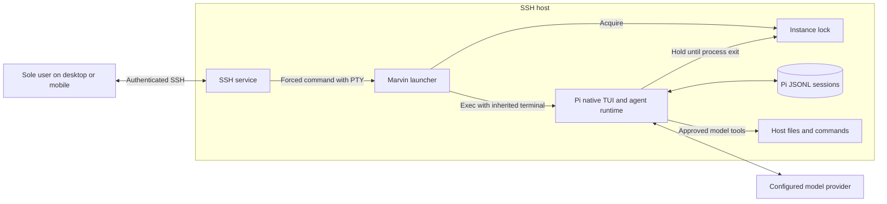

# Marvin System Architecture

**Status:** Proposed for the first release  
**Scope:** Runtime boundaries, state ownership, persistence, and externally visible behavior. Launcher files and exact Pi CLI arguments belong in [`program-design.md`](./program-design.md).

## Goals

Marvin is a private personal AI assistant reached through Pi's native terminal user interface (TUI) over SSH. The first release must:

- serve the sole user authorized by the SSH host;
- work from compatible desktop and mobile SSH clients;
- retain completed conversation context across process restarts;
- run agentic work with approved tools, including shell access;
- retain ordinary prompts submitted during a run through Pi's native queues;
- show accepted, queued, response, and failure feedback through Pi's TUI; and
- run on one host without a Marvin network service, application database, or custom interface.

## Decisions

1. **SSH is the access boundary.** The host authenticates and authorizes the sole user, allocates a pseudo-terminal (PTY), and starts a forced Marvin command. Marvin has no second user allowlist and opens no listener.
2. **Marvin is a launcher, not an assistant runtime.** It validates local launch inputs, acquires the instance lock, and replaces itself with the pinned Pi CLI in interactive mode with the SSH terminal attached unchanged. It does not embed Pi's SDK or use RPC mode.
3. **Pi owns interactive behavior.** Pi owns editing, prompt admission, steering and follow-up queues, commands, model and tool execution, retries, rendering, and request failures.
4. **Pi owns conversation state.** Pi's native JSONL session is the only conversation store. Each launch asks Pi to continue the newest discoverable session for Marvin's workspace, creating one when none exists. Marvin never reads or edits session contents.
5. **One launcher-managed Pi instance is active.** The launcher acquires a non-blocking host advisory lock that the Pi process inherits until exit. A competing launch reports busy before starting Pi or opening a session.
6. **Marvin sets only its base behavior.** The launcher supplies a Marvin base system prompt and an initial allowlist of model-facing tool names. Pi settings, trusted resources, commands, and model selection remain native.
7. **The terminal connection is volatile.** Pi remains the foreground process attached to the SSH session. Marvin has no daemon, detached terminal, output buffer, or replay protocol.
8. **The operating system is the security boundary for tools.** A working directory and Pi's tool allowlist are not a sandbox. Marvin runs as a dedicated non-root identity or in a restricted container.

The instance lock coordinates supported launches. It does not prevent the trusted account or a shell command from invoking another Pi process outside Marvin.

## System context



Pi and approved tools may make other outbound requests allowed by their trusted settings and operating-system environment. Marvin itself adds no network integration.

## Responsibilities

| Component | Responsibility |
| --- | --- |
| SSH host | Authenticate the sole user, allocate the PTY, enforce the forced command, and block alternate account access paths. |
| Marvin launcher | Validate deterministic local inputs, acquire the instance lock, select fixed Pi arguments, and replace itself with Pi in the workspace. |
| Pi native TUI | Accept terminal input and display prompts, queue state, progress, tools, responses, and failures. |
| Pi agent runtime | Own request state, native queues, model and tool execution, retries, and the active session. |
| Pi session store | Persist native conversation entries across launches. |

Marvin does not parse prompt text, model events, session JSONL, or terminal output.

## Connection and prompt flow

```text
SSH authentication
  -> forced Marvin launcher with PTY
  -> local validation and non-blocking instance lock
  -> pinned Pi CLI with --continue
  -> native Pi editor
  -> native prompt, queue, model, tool, session, and rendering behavior
```

The client must provide an interactive PTY, UTF-8 text, resize events, and key sequences supported by Pi. The launcher can reject a missing PTY; terminal-specific compatibility is established by deployment tests.

Pi handles editor submissions as follows:

| Input | Native behavior |
| --- | --- |
| Empty editor submission | No prompt is submitted. |
| Ordinary prompt while idle | Pi accepts it, displays the user message and working state, and starts the run. |
| Ordinary prompt submitted with Enter while running | Pi retains it as steering input and displays its queued state. |
| Ordinary prompt submitted with Alt+Enter while running | Pi retains it as follow-up input and displays its queued state. |
| Slash command or another Pi-native control | Pi applies that control's native behavior; it is not a Marvin prompt. |

Queued prompts can be retrieved or restored through Pi's native controls. Marvin neither copies nor separately persists them. Pi-native session switching remains available but is not a Marvin-specific feature or a guaranteed first-release workflow.

## State and persistence

The launcher owns only `starting` and `busy`. After `exec`, Pi owns the inherited lock, `idle`, `running`, queued input, and request settlement.

- `--continue` selects Pi's newest discoverable session whose recorded working directory matches Marvin's workspace when a custom session directory is used.
- If no matching session exists, Pi creates a new persistent session through its native behavior.
- Completed native session entries survive process restarts.
- Active generation, undelivered terminal bytes, and queued prompts may be lost on exit or disconnect.
- The terminal screen and client scrollback are not conversation storage.
- Session files may contain prompts, responses, tool calls, commands, and tool output and are sensitive personal data.

There is no Marvin database, pending-prompt store, response log, replay cursor, or session index.

## Output and failures

Pi is the only renderer. It writes one ordered terminal byte stream to the inherited PTY; Marvin does not split, reorder, translate, or retry output. A reconnect restores persisted conversation context, not the previous screen or unseen in-flight output.

| Condition | Required behavior |
| --- | --- |
| SSH authentication or authorization failure | SSH rejects access before Marvin starts. |
| Missing PTY, invalid local configuration, or unusable local path | The launcher prints one concise actionable error and exits non-zero before Pi starts. |
| Instance lock already held | The launcher reports that Marvin is busy and exits non-zero before Pi starts. |
| Pi startup failure | Pi's native error reaches the attached terminal and the Pi process exits non-zero. |
| Model, authentication, or tool failure after submission | Pi applies native retries, displays the final failure, and remains usable when the failure is recoverable. |
| SSH disconnect or terminal failure | Foreground Pi ends after SSH detects the loss, subject to the configured keepalive bound; Marvin does not buffer or replay output. |
| Launch or Pi process failure | The lock is released by process exit. The next launch continues persisted state but does not infer volatile work. |

Deterministic local checks happen before the editor. Model availability and provider authentication remain Pi-native because the launcher has no SDK integration. The pinned Pi release must satisfy the product's accepted, queued, and actionable-failure feedback in contract tests; Marvin does not add a second output layer to correct it.

## Configuration

| Setting | Required | Purpose |
| --- | --- | --- |
| SSH account and administrator-owned credentials | Yes | Sole-user authentication and authorization boundary. |
| `/etc/marvin.conf` | Yes | Administrator-owned workspace, optional session directory, and absolute Node path. |

Pi provider credentials, model choice, settings, and resources use Pi's standard mechanisms. The SSH client supplies no Marvin configuration.

The initial model-facing tool names are `read`, `bash`, `grep`, `find`, and `ls`. The base prompt and tool names constrain normal model behavior but are not a security sandbox. Context files and skills can append instructions, and trusted extensions can alter runtime behavior or provide same-named tools.

## Security

1. Use a dedicated non-root account with an administrator-controlled login shell. Its authorized credential source, forced command, configuration, lock inode, Node runtime, launcher, dependency tree, and Marvin base prompt are administrator-owned and not writable by the account.
2. Disable password and keyboard-interactive login, forwarding, user SSH startup files, user-supplied environments, arbitrary SSH commands, and alternate authorized-key sources for that account.
3. Audit the effective SSH policy and pre-shell environment; do not accept variables that can alter Marvin, Pi, Node, executable lookup, or shell startup.
4. Treat the workspace, Pi settings, extensions, packages, skills, prompt templates, context files, and themes as trusted inputs.
5. Do not place provider credentials in source control or deliberately copy them into sessions. Because `read` and `bash` share the account's OS access, the tool policy cannot technically prevent credential access or disclosure.
6. Keep the session directory private and back it up as sensitive personal data.
7. Do not rely on the workspace or tool allowlist for filesystem, credential, or network isolation. Use a container or credential broker if that isolation is required.
8. Do not use `tmux`, `screen`, or another mechanism to detach Pi. Intentionally detached tool descendants are unsupported and outside Marvin's lifecycle guarantees.
