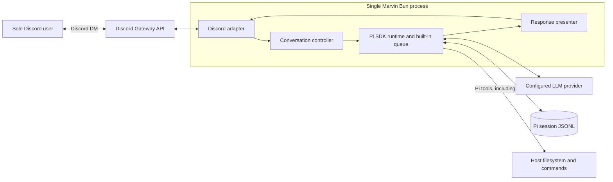
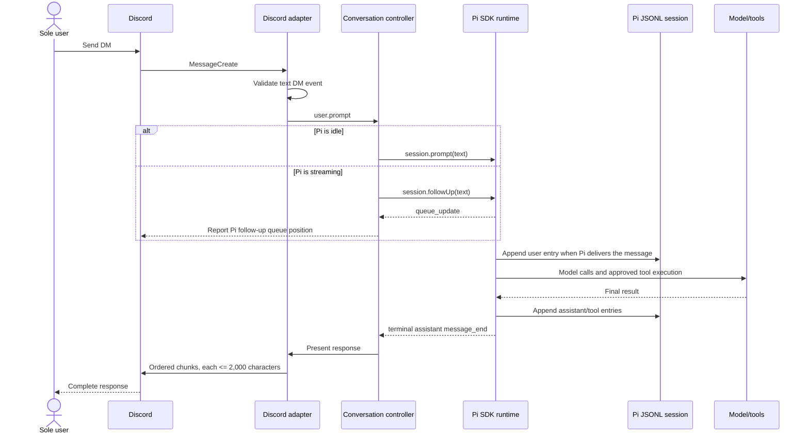
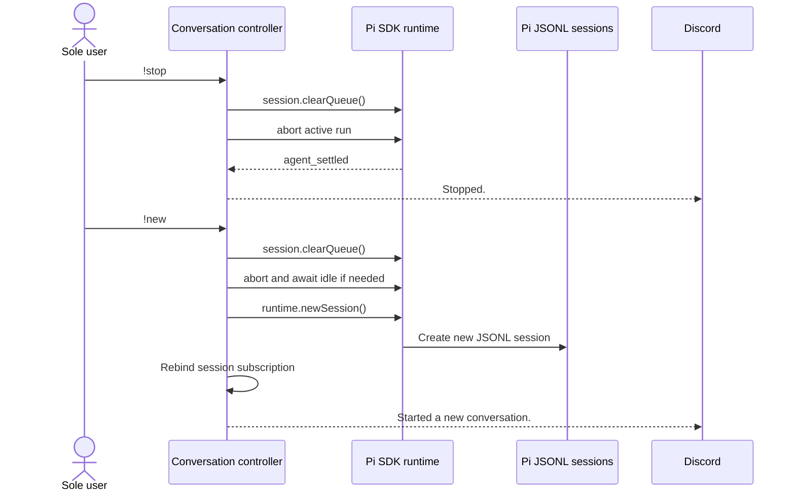
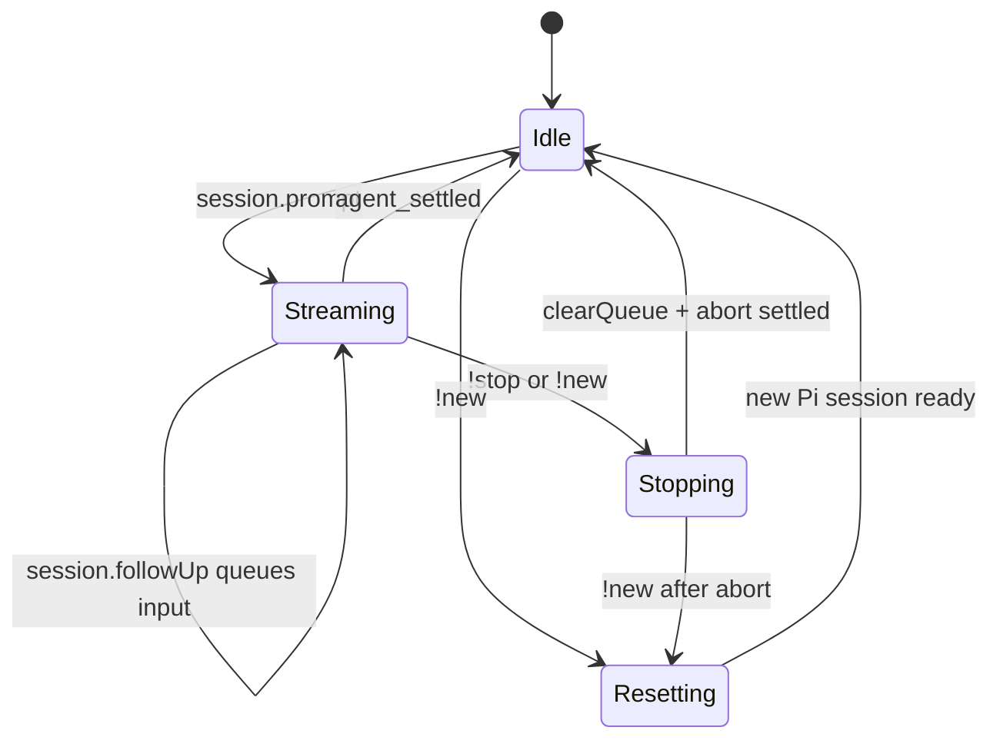

# Marvin System Architecture

**Status:** Proposed for the first release  
**Scope:** Service boundaries, event contracts, state, and runtime flows. File layout, types, and function signatures belong in a separate program-design document.

## Goals and constraints

Marvin is a personal AI assistant reached through Discord direct messages. The first release must:

- serve the sole Discord user who can see and message the bot;
- preserve conversational context across process restarts;
- run agentic tasks with shell access;
- acknowledge work promptly and expose running, queued, stopped, and failed states;
- deliver responses without losing text at Discord's message-size boundary; and
- remain simple to run as a personal, single-host service.

## Architecture decisions

1. **One Bun process.** The Discord adapter, conversation controller, and Pi agent runtime run in the same process. There is no HTTP API, worker service, broker, or database.
2. **Pi SDK for the agent runtime.** Marvin embeds `@earendil-works/pi-coding-agent` and uses `AgentSessionRuntime` for prompting, cancellation, and clean-session replacement.
3. **Pi JSONL is the only persistent conversation store.** `SessionManager` owns session creation, append-only message history, compaction, and restoration.
4. **One user, one active conversation.** The bot is visible to one Discord user, and that user's DM maps to one active Pi session. `!new` starts a fresh session while retaining prior JSONL files.
5. **Pi owns message queueing.** The first prompt starts with `session.prompt(...)`; additional prompts received while Pi is streaming use `session.followUp(...)`. Pi delivers follow-ups one at a time and exposes queue state through `queue_update` and `pendingMessageCount`. Marvin does not maintain a parallel prompt FIFO. Pi's pending queue is intentionally not durable in the first release.
6. **Shell isolation is an operating-system boundary.** Pi's `bash` tool runs with the Marvin process's permissions. A configured working directory limits default command location, not filesystem authority; Marvin must run as a dedicated, non-root user or in a container with only intended resources mounted.

## System context



Discord's Gateway API and the selected model provider are Marvin's only required network integrations. Shell commands inherit whatever network access the OS or container grants. Marvin opens no inbound network port.

## Component responsibilities

| Component | Responsibility |
| --- | --- |
| Bootstrap and configuration | Validate secrets, workspace, model availability, tool allowlist, and session directory before connecting to Discord. |
| Discord adapter | Accept non-bot text DMs, convert Discord events into internal events, and send acknowledgements, control responses, and ordered response chunks. |
| Conversation controller | Interpret local control commands, route idle input to `prompt` and streaming input to `followUp`, enforce queue admission limits, and coordinate abort/new-session transitions. |
| Pi runtime bridge | Own the active `AgentSessionRuntime` and its built-in follow-up queue; subscribe to lifecycle, message, tool, and queue events; clear/abort work; and replace sessions. |
| Pi `SessionManager` | Continue the latest session at startup and persist Pi's native versioned JSONL session entries. |
| Response presenter | Extract final assistant text, split it into valid Discord messages, preserve ordering, and suppress unwanted mentions. |
| Structured logger | Write metadata-only lifecycle and error events to stdout; never log prompts, response bodies, shell commands, tool output, tokens, or credentials. |

## Ingress and control contracts

### Accepted Discord event

Marvin consumes `MessageCreate` events. Discord application visibility is trusted as the user boundary; the adapter only validates the event shape:

```text
author.bot       = false
channel.type     = DM
content.trim()   is non-empty
```

Bot-authored or non-DM events are ignored. Attachment-only messages receive a short "text only" response; attachments are not sent to the model in the first release.

After validation, the adapter produces this logical event:

```json
{
  "type": "user.prompt",
  "discord_message_id": "string",
  "discord_channel_id": "string",
  "text": "string",
  "received_at": "ISO-8601 timestamp"
}
```

Discord IDs are correlation metadata only. They are not a second conversation store.

### Local control messages

Control messages are handled before queueing and are not forwarded to Pi:

| Message | Contract |
| --- | --- |
| `!stop` | Call `session.clearQueue()`, abort the active Pi run, suppress its partial answer, and reply `Stopped.` once the runtime is idle. No-op safely when already idle. |
| `!new` | Clear Pi's queue, abort and await any active run, create a new persistent Pi session, rebind session event subscriptions, and acknowledge the new conversation. Old JSONL sessions remain available. |
| `!status` | Derive and return `idle`, `running`, or `running; N queued` from Pi's session state without changing it. |

The control path bypasses Pi's follow-up queue but is serialized by the conversation controller so a session cannot be replaced during an active write.

### Agent completion

The Pi bridge emits these logical outcomes to the controller as Pi messages and lifecycle events arrive:

```text
assistant { session_id, text }
stopped   { session_id }
failed    { session_id, public_error, error_id }
```

Provider details, stack traces, and tool output never appear in `public_error`.

## Pi SDK boundary

Marvin creates an `AgentSessionRuntime` with:

- `cwd` set to the validated Marvin workspace;
- `SessionManager.continueRecent(workspace, sessionDirectory)` at startup;
- Pi's standard `AuthStorage`, `ModelRegistry`, and settings/model resolution;
- an application-owned system prompt suitable for a Discord assistant;
- an explicit tool allowlist that includes `bash` and only the approved supporting tools;
- Pi's `followUpMode` fixed to `one-at-a-time`; and
- Pi compaction and retry behavior from validated Pi settings.

The default supporting-tool set is `read`, `bash`, `grep`, `find`, and `ls`. Omitting `edit` and `write` is not a security boundary because shell commands can still mutate files. Filesystem and process restrictions must be enforced by the deployment environment.

Marvin consumes Pi events as follows:

| Pi event | Marvin behavior |
| --- | --- |
| `agent_start` | Mark the session running. |
| `queue_update` | Derive queue depth and status from `followUp.length`; never log the queued text. |
| user `message_start` | Observe when Pi promotes the oldest follow-up into the active turn. |
| `tool_execution_start/end` | Emit metadata-only telemetry. |
| `message_update` | Do not post partial Discord messages; wait for a complete response. |
| terminal assistant `message_end` | Publish the completed answer for that one-at-a-time turn. |
| `agent_end` | Observe the run boundary and retry state; do not treat it as the only response event. |
| `agent_settled` | Mark the session idle. |
| aborted/error result | Suppress partial text for an explicit stop; otherwise produce a concise failure. |

When Pi is idle, Marvin calls `session.prompt(text)`. While Pi is streaming, Marvin calls `session.followUp(text)`; Pi queues and drains those messages in order under `one-at-a-time` mode. Queue admission and `!status` read `session.pendingMessageCount` or `queue_update` counts. Marvin keeps no second copy of queued prompt text.

## Primary flows

### User prompt



If a prompt arrives while Pi is running, `session.followUp(...)` adds it to Pi's queue and Marvin immediately reports the resulting position. In `one-at-a-time` mode, Pi promotes the oldest follow-up only after the current agent turn would otherwise stop, then waits for its response before promoting another.

### Stop and reset



## Persistence model

Pi's session format is authoritative. Files live in the configured session directory and contain versioned JSONL entries. The following lines show only the fields relevant to this architecture; Pi writes the complete native message schema:

```json
{"type":"session","version":3,"id":"uuid","timestamp":"ISO-8601","cwd":"/configured/workspace"}
{"type":"message","id":"entry-id","parentId":null,"timestamp":"ISO-8601","message":{"role":"user","content":"..."}}
{"type":"message","id":"entry-id","parentId":"entry-id","timestamp":"ISO-8601","message":{"role":"assistant","content":[{"type":"text","text":"..."}],"stopReason":"stop"}}
```

The actual schema, tree links, tool results, model changes, and compaction entries remain Pi-owned. Marvin must use `SessionManager` APIs rather than parsing or editing session files directly.

Persistence rules:

- Startup continues the most recently modified Marvin session, or creates one when none exists.
- `!new` changes the active session; it does not delete history.
- Completed Pi entries survive process restarts. Pi's pending follow-up queue and an in-flight Discord delivery do not.
- The session directory must be private to the Marvin OS account and included in backups according to the user's needs.
- Session files contain prompts, responses, shell calls, and tool output and must be treated as sensitive data.

## Pi queue and lifecycle state

Pi owns both the active run and queued follow-ups. Marvin derives externally meaningful state from `session.isStreaming`, `session.pendingMessageCount`, `queue_update`, and `agent_settled`:



Queue contract:

```text
idle                         -> session.prompt(text)
streaming and below limit    -> session.followUp(text)
streaming and at limit       -> reject new input with retry-later feedback
!stop or !new                -> session.clearQueue(), then session.abort()
status                       -> session.isStreaming + session.pendingMessageCount
```

The admission limit guards Pi's queue but does not create a second queue. Pi holds pending follow-up text in memory and persists a user message to JSONL only when that message is delivered into a turn, so undelivered follow-ups are lost on restart. A deployment must run only one Marvin process for a given Discord token and session directory; concurrent writers are unsupported.

## Discord response contract

- If work is already active, call `session.followUp(...)` and acknowledge the position reported by Pi's resulting queue state.
- Do not stream token deltas into Discord; publish only the completed answer.
- Split output into chunks of at most 2,000 characters, preferring paragraph, newline, then whitespace boundaries before a hard split.
- Preserve all text and balance/reopen Markdown code fences across chunk boundaries.
- Send chunks sequentially and disable automatic user/role/everyone mentions.
- If Pi returns no user-visible text, send a concise fallback rather than an empty Discord message.

## Failure behavior

| Failure | Required behavior |
| --- | --- |
| Missing/invalid configuration, unavailable model credentials, invalid workspace, or unreadable latest session | Fail closed before Discord login with an actionable metadata-only startup error. Do not silently start a blank conversation after a session error. |
| Model or tool failure | Let Pi apply its configured retry policy, persist whatever Pi records, and send a concise failure with an error ID after a terminal error. Follow-up delivery remains owned by Pi; Marvin does not recover through a second queue. |
| Explicit `!stop` | Call `session.clearQueue()` before aborting, suppress partial assistant text, and acknowledge only after Pi emits `agent_settled`. |
| Discord send failure | Retry a small bounded number of times with backoff; log the message ID, chunk index, and error ID. There is no durable outbound replay in v1. |
| Process termination | Stop accepting events, call `session.clearQueue()`, abort/settle Pi, dispose the runtime, and close the Discord client within a bounded shutdown window. |
| Process crash | On restart, continue the latest valid Pi session. Do not attempt to infer or replay prompts that were only in memory. |

## Configuration contract

| Setting | Required | Purpose |
| --- | --- | --- |
| `DISCORD_TOKEN` | Yes | Discord bot credential; secret and never logged. |
| `MARVIN_WORKSPACE` | Yes | Existing absolute directory used as Pi's `cwd` and the shell's starting directory. |
| `MARVIN_SESSION_DIR` | No | Dedicated directory for Pi JSONL sessions; defaults beneath Pi's agent directory, isolated from ordinary CLI sessions. |
| `MARVIN_MODEL` | No | Optional Pi model/thinking selection. If absent, use Pi's normal settings and available-model resolution. |
| `MARVIN_TOOLS` | No | Explicit approved Pi tool names; defaults to the supporting-tool set above. Unknown tools fail startup. |
| `MARVIN_MAX_PENDING` | No | Maximum accepted Pi follow-ups while streaming. Admission uses `pendingMessageCount`; no Marvin-owned prompt queue is created. |

Pi provider credentials, custom model definitions, and settings stay in Pi's standard auth/model/settings mechanisms rather than being copied into Marvin configuration.

## Security and privacy boundaries

1. Trust Discord's private application visibility as the user boundary.
2. Use only direct-message intents; do not request guild-message behavior for this product.
3. Disable mention expansion on every outbound message.
4. Run Marvin as a dedicated, non-root OS identity. Restrict its readable files, environment variables, executable paths, network access, and mounted workspace to what the assistant is intended to use.
5. Treat `MARVIN_WORKSPACE` as a convenience and context boundary, not a sandbox. The `bash` tool can address paths outside it whenever the OS allows.
6. Keep the Discord token and model credentials out of source control and session files.
7. Protect and back up the session directory as sensitive personal data; do not duplicate transcript content into operational logs.
8. Load only application-approved Pi tools/resources. Arbitrary extensions execute inside the Marvin process and therefore require the same trust as application code.

---

This document follows the system-architecture guidance in [Why Software Factories Fail](https://github.com/humanlayer/advanced-context-engineering-for-coding-agents/blob/main/wsff.md#system-architecture): align on services, event contracts, schemas, queues, stores, and their interactions before moving into program design.
